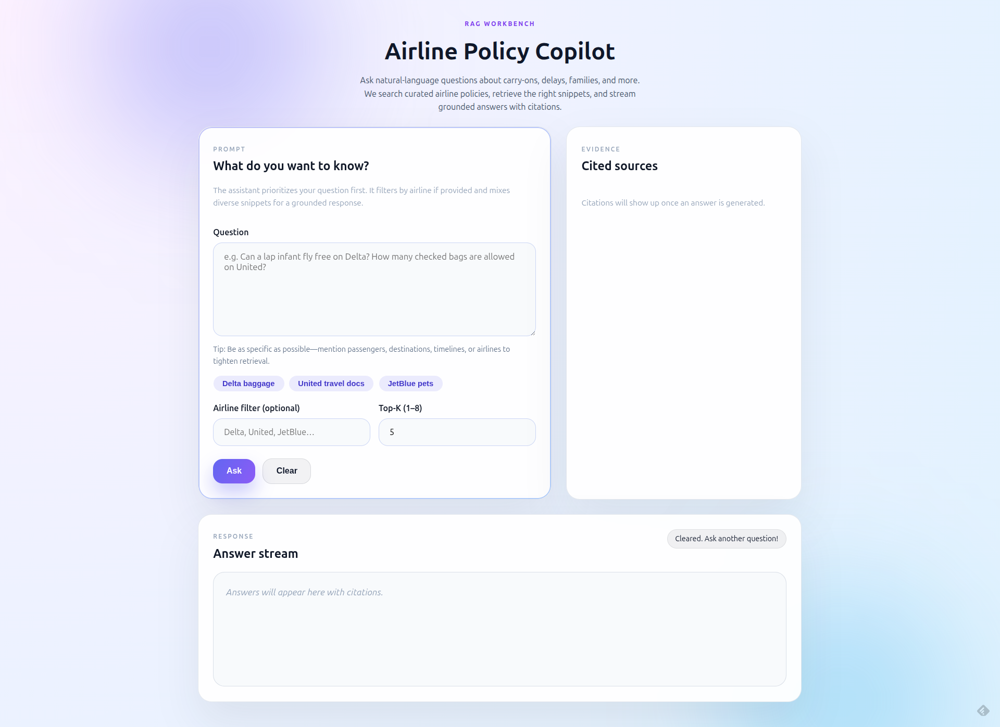
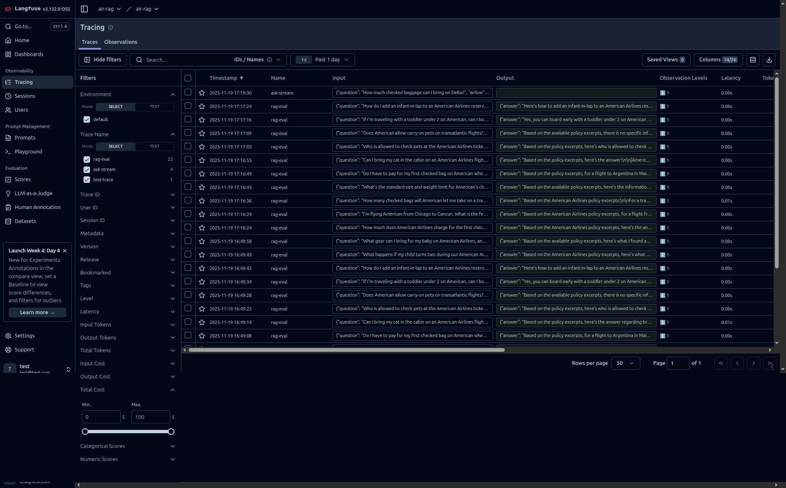

## LLM Airline Policy App

### Project Overview

This project implements a small, retrieval‑augmented generation (RAG) application that answers user questions about airline policies (Delta, United, American Airlines) using an LLM and a vector database. Policy documents in `policies/` (Markdown and PDF) are ingested, chunked, embedded, and indexed for similarity search. The API assembles relevant context and asks the LLM to produce concise, grounded answers with citations to the source documents.

### Documentation

- Full challenge description (original README.md file): [docs/challenge.md](docs/challenge.md)
- Analysis and proposed solution: [docs/analysis.md](docs/analysis.md)
- System Architecture: [docs/architecture.md](docs/architecture.md)
- UI Screenshot: 

### Design Choices and Tradeoffs

- **RAG Implementation**: The application utilizes a standard RAG pattern, combining a FAISS vector store for efficient retrieval with an LLM (gpt-5-mini by default) for generative answers. This approach prioritizes grounded responses and reduces hallucination.
- **Vector Store**: FAISS was chosen for its simplicity and efficiency in local, on-disk index management, suitable for this project's scale. For larger deployments, cloud-native vector databases like Pinecone or Weaviate would be considered.
- **LLM and Embeddings**: LiteLLM is used to abstract away specific LLM and embedding providers, allowing easy switching between OpenAI and other compatible models. This provides flexibility and cost optimization.
- **Streaming**: Server-Sent Events (SSE) are used for streaming answers to provide a more responsive user experience, especially for longer generations.
- **Caching**: An in-memory cache is implemented for the `/ask` endpoint to reduce latency and LLM costs for repeated queries.
- **Error Handling**: Comprehensive error handling is in place, providing user-friendly messages for common issues like missing vector stores, LLM generation failures, and rate limit excesses.
- **Structured Logging**: JSON-formatted logs are used for improved observability and easier integration with logging platforms.
- **Rate Limiting**: A basic rate limiting mechanism based on client IP is included to prevent abuse and ensure fair usage of the API.

### Rate Limiting

Basic rate limiting is implemented to protect the API from abuse. Requests are limited per client IP address. The rate limit can be configured via the following environment variables:

- `RATE_LIMIT_TTL_SECONDS`: The time window in seconds for the rate limit (default: `60`).
- `RATE_LIMIT_MAX_REQUESTS`: The maximum number of requests allowed within the `TTL` window (default: `60`).

### Configuration

The application is configured via environment variables. Copy `.env.example` to `.env` and adjust the values as needed.

| Variable | Description | Default |
| :--- | :--- | :--- |
| `OPENAI_API_KEY` | API Key for OpenAI (or compatible provider). | *(Required)* |
| `LLM_BASE_URL` | Base URL for the LLM provider (e.g., for local models). | `None` |
| `EMBEDDINGS_MODEL` | Model ID for generating text embeddings. | `text-embedding-3-small` |
| `LLM_MODEL` | Model ID for answer generation. | `gpt-5-mini` |
| `VECTOR_STORE_PATH` | Directory to persist/load the FAISS index. | `data/faiss` |
| `LLM_TIMEOUT_SECONDS` | Timeout (in seconds) for LLM requests. | `30` |
| `EMBEDDINGS_TIMEOUT_SECONDS` | Timeout (in seconds) for embedding requests. | `30` |
| `ASK_CACHE_MAX_ITEMS` | Maximum number of items in the in-memory cache. | `128` |
| `ASK_CACHE_TTL_SECONDS` | Time-to-live (seconds) for cached items. | `600` |
| `LANGFUSE_*` | Telemetry configuration (Public Key, Secret Key, Host). | `None` |

### Prerequisites

- **Docker** (Desktop or Engine)
- **Docker Compose**

### Running Everything with Docker

All workflows (ingestion and the future API) are executed via Docker, ensuring a consistent environment without manual dependency management.

1. Copy `.env.example` to `.env` and fill in the required variables (e.g., `OPENAI_API_KEY`, `EMBEDDINGS_MODEL`, `LLM_MODEL`).
2. Build the shared image used by every service:
   ```bash
   docker compose build
   ```
3. Run ingestion inside a disposable container whenever policies change:
   ```bash
   docker compose run --rm ingest
   ```
   This performs the entire pipeline inside Docker: load policy files, write `data/processed.jsonl`, and persist the FAISS artifacts under `data/faiss/`.
4. Start the FastAPI backend **and** the lightweight front-end UI with live reload:
   ```bash
   docker compose up app
   ```
   - The `app` service serves both the API (`/ask`, `/ask/stream`, `/healthz`) and the streaming UI hosted at `http://localhost:8000/`.
   - Once the container is running, open `http://localhost:8000` in your browser to use the front-end or `http://localhost:8000/docs` for the interactive API docs.
   - The container mounts the repo so code edits (Python or `app/templates/index.html`) are reflected immediately.
5. Tear everything down when finished:
   ```bash
   docker compose down
   ```

#### Running Tests

To execute the unit test suite inside the container:
```bash
docker compose run --rm app pytest
```

No host-side `pip install` steps are required; the Docker image contains all runtime dependencies.

### Structured Logging

The application uses structured JSON logging for all output, making it easier to parse and analyze in various environments. The log level can be configured via the `LOG_LEVEL` environment variable (default: `INFO`). Valid values include `DEBUG`, `INFO`, `WARNING`, `ERROR`, and `CRITICAL`.

### Rate Limiting

Basic rate limiting is implemented to protect the API from abuse. Requests are limited per client IP address. The rate limit can be configured via the following environment variables:

- `RATE_LIMIT_TTL_SECONDS`: The time window in seconds for the rate limit (default: `60`).
- `RATE_LIMIT_MAX_REQUESTS`: The maximum number of requests allowed within the `TTL` window (default: `60`).

### API & Streaming

- `POST /ask` accepts a JSON body with `question`, optional `top_k` (≤8), optional `airline`, and an optional `stream` flag. Responses include concise LLM answers plus structured citations.
- `POST /ask/stream` also accepts the same parameters and returns a Server-Sent Events stream (`text/event-stream`).
- `GET /metrics` returns basic monitoring metrics for the service, including total requests, current requests, errors, and uptime.
- Setting `stream: true` upgrades the response to a Server-Sent Events stream (`text/event-stream`). Each event contains incremental tokens followed by a `final` payload with the rendered answer, citations, token counts, and latency/cost metadata.
- The backend keeps a short-lived in-memory cache keyed by normalized question + airline filter so repeated queries are served instantly without re-calling the LLM.

#### Quickstart via CLI (curl)

You can query the API directly from your terminal:

```bash
# Basic query
curl -X POST "http://localhost:8000/ask" \
     -H "Content-Type: application/json" \
     -d '{"question": "Can I bring my cat on board?", "airline": "Delta"}'

# Streaming response
curl -N -X POST "http://localhost:8000/ask/stream" \
     -H "Content-Type: application/json" \
     -d '{"question": "What is the checked bag fee?", "stream": true}'
```

### Example Q&A

Here are example answers for key queries, demonstrating the application's ability to retrieve relevant information and provide cited responses:

1.  **Question**: "Can I bring my cat on board?"
    **Answer**: "Yes, you can bring your cat on board if it meets the airline's pet policy requirements. This typically includes guidelines on carrier size, vaccination, and applicable fees. Please check the specific airline's pet policy for full details."
    **Citations**:
    -   `American Airlines: Pet Policy`
    -   `Delta: Pets`

2.  **Question**: "What is the checked bag policy for international flights?"
    **Answer**: "Checked bag policies for international flights vary by airline and destination. Factors such as fare class, loyalty status, and ticket type can also affect allowances and fees. It is recommended to check the specific airline's website for detailed information on weight, dimensions, and any associated costs."
    **Citations**:
    -   `American Airlines: Checked bag policy`
    -   `Delta: Baggage & Travel Fees`
    -   `United: Checked bags`

3.  **Question**: "What are the rules for flying with an infant?"
    **Answer**: "When flying with an infant, policies vary by airline but generally involve rules around age, seating (lap infant or separate seat), and required documentation. Some airlines may offer amenities like bassinets or allow certain baby items (e.g., strollers, car seats) to be checked free of charge. Refer to your airline's specific policy for detailed guidelines."
    **Citations**:
    -   `Delta: Children Infant Travel`
    -   `United: Flying with Kids & Family Boarding`

4.  **Question**: "I am pregnant, what should I know before flying?"
    **Answer**: "Airlines generally allow pregnant passengers to fly, but specific restrictions may apply, especially in later stages of pregnancy. It is often recommended to consult with a doctor before traveling and to carry a doctor's note. Some airlines may require medical clearance for travel beyond a certain week of gestation. Always check your airline's specific policy for flying while pregnant."
    **Citations**:
    -   `United: Flying while Pregnant`

### Limitations and External Links

- The RAG system is limited to the information contained within the provided policy documents in the `policies/` directory. It cannot answer questions outside this scope.
- While the system attempts to extract and cite external URLs found within documents, it does not actively crawl or retrieve information from these external links. Answers are strictly grounded in the ingested content.

### Observability & Tracing

The application is instrumented with [LangFuse](https://langfuse.com/) for full-stack observability. For detailed information on trace structures, metrics, and dashboard setup, please refer to the [Langfuse Integration Guide](docs/langfuse.md).



**Configuration:**
Ensure the following environment variables are set (see `.env.example`):
- `LANGFUSE_PUBLIC_KEY`
- `LANGFUSE_SECRET_KEY`
- `LANGFUSE_HOST` (default: `https://cloud.langfuse.com`).
  - **Local Docker Note**: If running LangFuse locally in a separate Docker container, set this to `http://host.docker.internal:3000` to allow the app container to reach the host network.

**Features:**
- **Request Tracing:** Every call to `/ask` (streaming or standard) generates a trace containing the input question, retrieved context, LLM generation, and final answer. Metadata includes token counts, costs, and latency.
- **Evaluation Logging:** Running the evaluation harness logs each test case as a trace tagged with `eval-harness` and relevant category tags. Metrics like recall, precision, and refusal accuracy are attached to the trace.

**Dashboards:**
In the LangFuse UI, you can create dashboards to monitor:
- **Latency:** Track P50 and P95 latency for `ask-request` traces.
- **Cost:** Monitor token usage and estimated USD cost per model.
- **Quality:** Filter traces by `eval-harness` to analyze regression in retrieval recall or answer quality over time.

- The eval dataset lives at `docs/evals/questions.jsonl` (35 curated questions covering baggage, pets, children, pregnancy, and a refusal scenario). Each record includes gold citations and whether a refusal is expected.
- Run the harness locally with:

  ```bash
  docker compose run --rm eval --dataset docs/evals/questions.jsonl --limit 10
  ```

  Results are written to `data/evals/run-*.jsonl` (git-ignored) and the summary metrics (Recall@k, MRR, citation precision/recall, refusal accuracy, latency P50/P95, token totals, and USD cost estimates) are printed and logged.
- The harness reports optional LangFuse traces when `LANGFUSE_PUBLIC_KEY`, `LANGFUSE_SECRET_KEY`, and `LANGFUSE_HOST` are configured. Each eval case is logged with its metrics, citations, and latency/cost metadata so later workflows (F/H) can inspect regressions.

### Methodology

This project was developed using a combination of AI agents:
- **Codex CLI**: Employed with `gpt-5.1-codex` (high/medium settings) for various development tasks.
- **Gemini CLI**: Utilized with `gemini-3-pro-preview` for specific problem-solving and implementation steps.

The `docs/tasks.md` file served as a comprehensive guideline, enabling parallel workstreams and efficient task management through GitHub worktrees where feasible.

### Future Improvements

- **Polish of the traces**: Polish the traces for better observability and debugging.
- **Prompt Injection Defense**: Implement a more robust sanitization layer or prompt injection detection mechanism. While the current setup places instructions after user input (a basic mitigation), a dedicated defense could be crucial if the application serves untrusted clients or faces advanced adversarial prompts. For internal or trusted clients, the current approach might be sufficient.